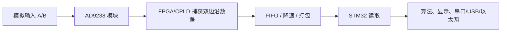
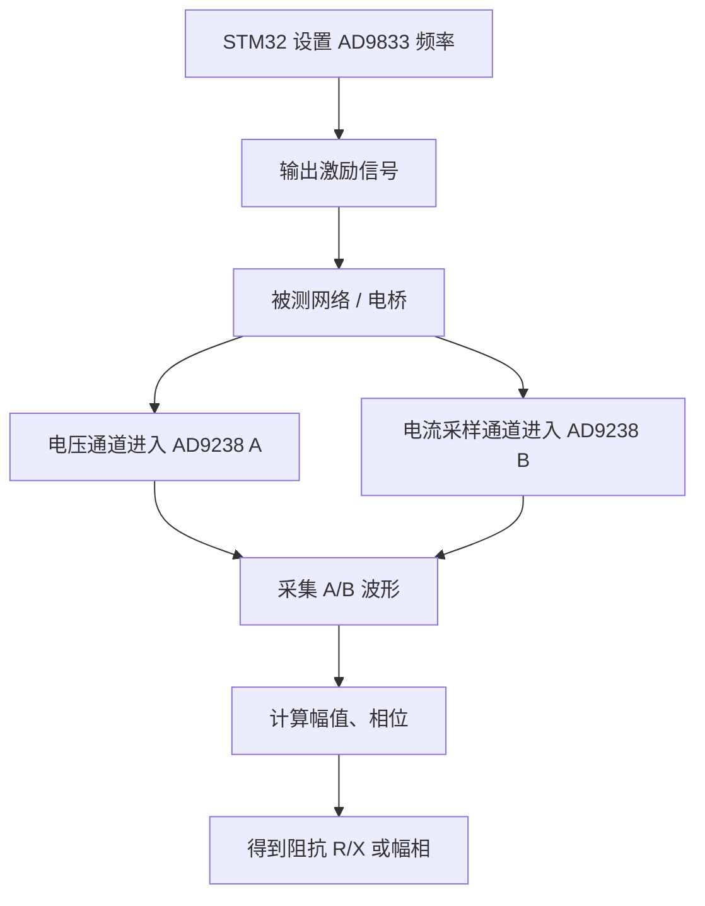
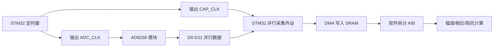

# AD9238 与 STM32：采集方案、PSSI + DMA 配置及接线

> 整理说明：本文档整合 AD9238 模块原理、仅使用 STM32 的采集方案、STM32H7R7 PSSI + DMA 工程配置、完整引脚表、外部连接和串口调试说明。阅读顺序为器件认识、总体方案、工程实现、引脚核对和外部接线。

## 本文档包含

1. AD9238 双路 ADC 模块与 STM32 使用整理
2. AD9238 只用 STM32 的采集方案
3. STM32H7R7 使用 PSSI + DMA 采集 AD9238 工程整理
4. AD9238_data_read 引脚配置表
5. AD9238 模块外部引脚连接说明

---

## 第 1 部分：AD9238 双路 ADC 模块与 STM32 使用整理

> 资料来源：`AD9238模块资料/用户手册/AD9238用户手册1.0.pdf`、`AD9238模块资料/芯片手册/ADI-AD9238-65.pdf`、`AD9238模块资料/原理图PDF/SCH_AD9238_SCH_2024-04-22.pdf`、`AD9238模块资料/参考程序/FPGA_Cyclone_IV_F17/rtl/AD9238_65.v`

### 1. 先给结论

这个 AD9238 模块不是 SPI ADC，而是 **高速并行 ADC 模块**。

AD9238 本体是双通道、12 bit ADC，最高采样率 65 MSPS。模块原理图把 AD9238 的 A、B 两个通道配置成了 **同一组 12 位数据总线交替输出**：

- 一根 `CLK` 同时送给 `CLK_A`、`CLK_B` 和 `MUX_SELECT`
- 模块接口只引出一组 `D0 ~ D11`
- 在一个时钟边沿读到 A 通道，在另一个时钟边沿读到 B 通道
- FPGA 参考程序也是在 `ADC_CLK` 的上升沿、下降沿分别锁存两路数据

所以如果目标是：

```text
双通道各 20 MSPS
```

那么 STM32 侧面对的不是普通“20 MHz 读一次”，而是：

```text
ADC 时钟 = 20 MHz
总线交替输出 = A/B/A/B/...
每个 ADC 时钟周期内要取 2 次 12 bit 数据
等效数据节拍 = 40 Msample/s
原始数据量 = 40M * 12 bit = 480 Mbit/s，约 60 MB/s
```

这对普通 GPIO 中断、软件轮询、普通 SPI 都不现实。建议方案是：

1. **低速验证**：先把 `CLK` 降到 1 MHz ~ 2 MHz，用 STM32 定时器 + GPIO 读数验证接线和换算。
2. **中高速采集**：用 STM32 的并行采集外设、DMA、外部触发、硬件锁存器，或者把数据先送 FPGA/CPLD。
3. **20 MSPS 双通道稳定采集**：更推荐 `AD9238 -> FPGA/CPLD -> STM32`，STM32 负责控制、低速读 FIFO、计算和通信。

### 2. AD9238 模块关键信息

| 项目 | 说明 |
|---|---|
| ADC 型号 | AD9238-65 |
| 通道数 | 双通道 A/B |
| 分辨率 | 12 bit |
| 最高采样率 | 65 MSPS |
| 最低推荐采样率 | 约 1 MSPS，低于此动态性能可能下降 |
| 模块供电 | 接口给 `+5VIN`，板上转换出模拟/数字 3.3 V |
| 数字输出电平 | 模块内部 AD9238 的 `DRVDD` 接 3.3 V，所以输出是 3.3 V CMOS 逻辑 |
| 输出格式 | 由 `DFS` 决定，模块原理图默认下拉，通常为 Offset Binary |
| 控制脚 | `PWDN`、`OEB`、`OTR` |
| 数据接口 | 12 位并行 `D0 ~ D11`，不是 SPI |
| 时钟接口 | 外部输入 `CLK`，同时作为 ADC 采样时钟和 A/B 复用选择信号 |

芯片手册中几个重要时序参数：

| 参数 | 典型/限制 |
|---|---|
| 最大转换率 | 65 MSPS |
| 最小转换率 | 1 MSPS |
| 65 MSPS 时钟周期 | 15.4 ns |
| 输出延迟 `tPD` | 典型 3.5 ns，最大 6 ns |
| Pipeline 延迟 | 7 个时钟周期 |
| DCS | 时钟占空比稳定功能，高电平使能 |

`Pipeline 延迟 7 个时钟周期` 的意思是：某一瞬间采样的模拟值，不会立刻出现在 D0-D11 上，而是延迟 7 个 ADC 时钟后输出。连续采集时只要忽略启动后的前几个样点即可。

### 3. 模块接口理解

从原理图看，模块对外主要是这些信号：

| 模块信号 | 方向 | 建议连接 | 说明 |
|---|---:|---|---|
| `+5VIN` | 输入 | 稳定 5 V 电源 | 模块板上再生成 3.3 V |
| `GND` | - | STM32 和模拟系统共地 | 地线尽量短、低阻 |
| `CLK` | 输入 | STM32 定时器输出 / 外部晶振 / FPGA 输出 | ADC 采样时钟 |
| `D0 ~ D11` | 输出 | STM32 并行输入口 / FPGA 输入 | 12 位数据，`D11` 是 MSB |
| `OTR` | 输出 | STM32 GPIO 输入，可选 | Out of Range，输入超量程提示 |
| `OEB_EXT` | 输入 | STM32 GPIO 输出或固定低电平 | 低电平使能数据输出，高电平高阻 |
| `PWDN_EXT` | 输入 | STM32 GPIO 输出或固定低电平 | 低电平正常工作，高电平掉电 |
| `NC0`、`NC1` | - | 不接 | 原理图标注为未连接/保留 |

#### 推荐上电状态

```text
PWDN_EXT = 0   // ADC 正常工作
OEB_EXT  = 0   // 数据总线输出使能
CLK      = 先不输出，等待电源稳定后再输出
```

模块用户手册特别提醒：`+5V` 和 `GND` 不要接反，模拟模块尽量用纹波小的线性稳压电源，不建议直接用噪声大的开关电源。

### 4. A/B 两路数据为什么在同一组 D0-D11 上？

AD9238 原芯片有 A、B 两组 12 位并行输出。但这个模块的原理图把 `MUX_SELECT` 接到了同一个 `CLK` 网络上，并且对外只引出 A 侧数据总线。

芯片手册说明：

- `MUX_SELECT = 1` 时，A 数据到 A 数据口，B 数据到 B 数据口
- `MUX_SELECT = 0` 时，A/B 数据口互换
- 如果 `CLK_A`、`CLK_B`、`MUX_SELECT` 同步，就可以在单个 12 位总线上交替得到 A/B 数据

FPGA 参考代码的核心逻辑：

```verilog
always @(posedge ADC_CLK) begin
    ADC_BUFA <= ADC_IN;
end

always @(negedge ADC_CLK) begin
    ADC_BUFB <= ADC_IN;
end
```

因此可以按下面方式理解：

```text
CLK 上升沿附近：读一路数据
CLK 下降沿附近：读另一路数据
```

实际哪一个边沿对应 A、哪一个边沿对应 B，建议用已知信号验证一次：

- A 输入接正弦波，B 输入接地或低频信号
- 采集后看上升沿缓冲和下降沿缓冲哪一路有波形
- 在代码里固定命名

### 5. 电压与数字码换算

模块用户手册给出的换算关系是：

```text
Volt = (Data - 2048) * 10 / 4096
```

即满量程约为：

```text
-5 V ~ +5 V
```

其中：

| 数字码 `Data` | 约等效输入电压 |
|---:|---:|
| 0 | -5 V |
| 2048 | 0 V |
| 4095 | +4.9976 V |

推荐代码写法：

```c
float ad9238_code_to_voltage(uint16_t code)
{
    return ((float)((int32_t)code - 2048) * 10.0f) / 4096.0f;
}
```

注意：这个换算关系来自模块模拟前端设计，不只是 AD9238 芯片本体。AD9238 芯片内部通常是 1 Vpp 或 2 Vpp 差分输入范围，模块前端用了 AD8132 等调理电路，把外部输入映射到 ADC 输入范围。

### 6. STM32 直接采集的可行性

#### 6.1 不建议的方式

不要用下面方式做 20 MSPS 双路采集：

- GPIO 中断：频率太高，中断进不来
- 软件轮询 GPIO：CPU 来不及稳定读 40M 次/秒
- 普通 SPI：AD9238 不是串行 ADC，没有 SPI 数据输出
- STM32 内部 ADC：这里的数据已经由外部 AD9238 转成数字，不需要也不能再用 STM32 ADC 重新采样

#### 6.2 低速调通方案

可以先把 `CLK` 降低到 1 MHz ~ 2 MHz，用 STM32 做验证：

```text
TIM 输出 PWM 作为 CLK
GPIO 输入 D0-D11
在定时器边沿附近读取 GPIO IDR
分别保存上升沿、下降沿数据
串口打印或 DMA 搬运少量数据
```

这个方案适合确认：

- 电源和接地没问题
- `PWDN`、`OEB` 控制正确
- 数据线位序正确
- 电压换算公式正确
- A/B 交替关系正确

但它不是最终 20 MSPS 方案。

#### 6.3 20 MSPS 双通道推荐方案

最稳妥架构：



FPGA/CPLD 做这些事：

- 产生低抖动 ADC 时钟
- 在上升沿、下降沿分别锁存 12 位总线
- 把 A/B 数据分离
- 写入 FIFO
- STM32 通过 FSMC/FMC、SPI、QSPI、并口或其他接口低速读取

这样 STM32 不需要直接面对 40M 次/秒的边沿采样压力。

### 7. 如果坚持 STM32 直接接，需要满足什么？

STM32 直接接需要同时满足：

1. 12 根数据线最好在同一个 GPIO 端口，方便一次读 `GPIOx->IDR`
2. 能用硬件方式按外部时钟/定时器节拍搬运 GPIO 数据到内存
3. DMA 带宽足够，至少几十 MB/s
4. 内存带宽足够，缓存策略正确
5. 采样边沿和数据有效窗口能对齐
6. PCB 走线足够短，数据线长度匹配，串扰可控

即使 STM32 主频很高，也不代表能稳定读这种高速并行 ADC。这里瓶颈主要不是 CPU 算力，而是：

- GPIO 输入采样时序
- 外部时钟同步
- DMA 触发能力
- 总线带宽
- 连续数据落内存能力

对于 `20 MSPS 双通道`，建议优先用 FPGA/CPLD。

### 8. STM32 低速验证接线示例

假设把 `D0 ~ D11` 接到同一个 GPIO 端口的低 12 位，例如 `GPIOE[0:11]`：

| AD9238 模块 | STM32 |
|---|---|
| `D0` | `PE0` |
| `D1` | `PE1` |
| ... | ... |
| `D11` | `PE11` |
| `CLK` | 定时器 PWM 输出脚 |
| `OEB_EXT` | GPIO 输出，拉低 |
| `PWDN_EXT` | GPIO 输出，拉低 |
| `OTR` | GPIO 输入，可选 |
| `GND` | GND |
| `+5VIN` | 5 V |

读取 12 位数据：

```c
static inline uint16_t ad9238_read_bus(void)
{
    return (uint16_t)(GPIOE->IDR & 0x0FFFu);
}
```

如果数据线没有接在连续位上，建议做一个映射函数，但高速时会明显增加 CPU 开销。调试阶段可以这样写，最终高速方案尽量让硬件连线连续。

### 9. 低速验证代码框架

下面只是帮助理解流程，不适合 20 MSPS 最终采集。

```c
#define AD9238_BUF_LEN 1024

uint16_t adc_a_buf[AD9238_BUF_LEN];
uint16_t adc_b_buf[AD9238_BUF_LEN];
volatile uint32_t adc_wr_index = 0;

static inline uint16_t AD9238_ReadBus(void)
{
    return (uint16_t)(GPIOE->IDR & 0x0FFFu);
}

void AD9238_Enable(void)
{
    HAL_GPIO_WritePin(AD9238_PWDN_GPIO_Port, AD9238_PWDN_Pin, GPIO_PIN_RESET);
    HAL_GPIO_WritePin(AD9238_OEB_GPIO_Port,  AD9238_OEB_Pin,  GPIO_PIN_RESET);
}

void AD9238_DisableOutput(void)
{
    HAL_GPIO_WritePin(AD9238_OEB_GPIO_Port, AD9238_OEB_Pin, GPIO_PIN_SET);
}

void AD9238_CaptureRisingEdge(void)
{
    uint32_t i = adc_wr_index;
    if (i < AD9238_BUF_LEN) {
        adc_a_buf[i] = AD9238_ReadBus();
    }
}

void AD9238_CaptureFallingEdge(void)
{
    uint32_t i = adc_wr_index;
    if (i < AD9238_BUF_LEN) {
        adc_b_buf[i] = AD9238_ReadBus();
        adc_wr_index = i + 1;
    }
}
```

真实工程里，上升沿/下降沿函数可以来自：

- 定时器输入捕获中断
- 外部中断
- 低速调试时的轮询

但一旦时钟提高到 MHz 级以上，中断方案很快就会失效。最终要换成硬件采集链路。

### 10. 与 AD9833/DAC1220 项目的关系

当前 `project_SPI_dds` 里还有 DDS 和 DAC 控制。可以按下面分工理解：

```text
AD9833：产生激励正弦波
DAC1220：产生慢速控制电压 / 偏置 / 校准电压
AD9238：高速采集电压、电流两路响应
STM32：配置、控制时序、读取采集结果、计算阻抗
```

如果你的目标是电桥/阻抗测量，可以形成这样的流程：



### 11. 采样率与 1 MHz 信号

如果输入信号是 1 MHz 正弦波：

| 每通道采样率 | 每周期点数 | 评价 |
|---:|---:|---|
| 5 MSPS | 5 点/周期 | 能看趋势，幅相精度有限 |
| 10 MSPS | 10 点/周期 | 可用，适合基础幅值/相位 |
| 20 MSPS | 20 点/周期 | 较理想，后续算法更舒服 |
| 40 MSPS | 40 点/周期 | 更好，但数据压力更大 |

你原先想用 `20M` 采 `1M` 两路信号，这个思路是合理的；真正难点是 STM32 如何可靠接住 AD9238 的并行高速数据。

### 12. 硬件注意事项

- `CLK` 抖动会直接影响高速 ADC 的信噪比，尽量用低抖动时钟源。
- `CLK`、`D0 ~ D11` 线要短，最好等长，避免飞线过长。
- 数字线附近不要贴着模拟输入线走。
- 5 V 电源要干净，模块说明不建议使用纹波大的开关电源直接供电。
- STM32 输入口要确认能承受 3.3 V CMOS 电平。
- `OEB` 未使能时数据口可能高阻，STM32 端不要悬空误判。
- `OTR` 拉高表示超量程，需要检查输入幅度或前端增益。

### 13. 调试步骤建议

1. **只接电源**：确认模块 5 V 输入正常，板上 3.3 V 正常。
2. **控制脚固定**：`PWDN = 0`，`OEB = 0`。
3. **给低速 CLK**：先从 1 MHz 或 2 MHz 开始，不要一上来 20 MHz。
4. **输入接地**：观察数据是否接近 2048。
5. **输入已知直流/低频正弦**：验证电压换算公式。
6. **区分 A/B**：A 输入信号，B 接地，看哪个边沿读到波形。
7. **逐步升频**：看数据是否开始错位、跳变、失真。
8. **确定最终架构**：如果要稳定双路 20 MSPS，加入 FPGA/CPLD 或专用并行采集外设。

### 14. 最终建议

对于这个项目，建议把 AD9238 部分拆成两阶段：

#### 阶段 1：STM32 低速验证

目标是确认模块能工作，数据换算正确，A/B 通道能区分。

```text
AD9238 CLK = 1 MHz ~ 2 MHz
STM32 GPIO 读 D0-D11
串口输出少量样点
```

#### 阶段 2：高速正式采集

目标是双路 20 MSPS 采集 1 MHz 信号，并做幅相/阻抗算法。

```text
AD9238 CLK = 20 MHz
FPGA/CPLD 双边沿锁存
FIFO 缓冲
STM32 批量读取数据并计算
```

如果不加 FPGA/CPLD，而只用 STM32，最好先确认所选 STM32 是否有合适的并行摄像头/外部存储/高速采集接口可以被外部时钟稳定触发，并实际测 DMA 带宽。否则工程风险会比较高。

---

## 第 2 部分：AD9238 只用 STM32 的采集方案

> 场景：比赛不允许使用 FPGA/CPLD，只能用 STM32 读取 AD9238 模块的数据。

### 1. 先说结论

只用 STM32 也可以读 AD9238，但方案要按目标采样率分层：

| 目标                   | 推荐方案                                   | 可行性        |
| -------------------- | -------------------------------------- | ---------- |
| 低速调试，1 MHz 以下 ADC 时钟 | GPIO 直接读 + 定时器/中断                      | 可行         |
| 几 MSPS 到十几 MSPS      | GPIO/并口 + DMA + 定时器触发                  | 有机会，但要实测   |
| 双路 20 MSPS           | STM32 的 PSSI/DCMI 类并行采集外设 + DMA + 短帧采样 | 勉强可做，工程难度高 |
| 双路 20 MSPS 无限连续采集    | 只用 STM32 不推荐                           | 数据量太大      |

关键点：这个模块把 A/B 两路复用到一组 `D0 ~ D11` 上。若 AD9238 的 `CLK = 20 MHz`，则 STM32 需要接收：

```text
A/B 交替数据节拍 = 40 MSample/s
每个样点按 16 bit 存储 = 80 MB/s
```

所以只用 STM32 时，建议做 **短时间采一帧，然后停下来计算**，不要想着一直把 20 MSPS 双路数据全量保存。

### 2. 推荐总体架构



建议 STM32 同时产生两路时钟：

| 时钟 | 用途 | 频率 |
|---|---|---:|
| `ADC_CLK` | 给 AD9238 模块采样 | 每通道采样率，例如 10 MHz 或 20 MHz |
| `CAP_CLK` | 给 STM32 采集外设当像素/并口采样时钟 | `2 * ADC_CLK` |

因为模块在 `ADC_CLK` 的上升沿、下降沿交替输出 A/B 数据，所以 STM32 端最好用 `CAP_CLK` 在每个半周期的中间去采样数据。

例如双路 20 MSPS：

```text
ADC_CLK = 20 MHz
CAP_CLK = 40 MHz
DMA 接收速率 = 40M 个 16bit 半字/秒 = 80 MB/s
```

### 3. 最推荐：PSSI 并行同步采集

如果你的 STM32 型号有 **PSSI**，优先用 PSSI。

PSSI 可以理解成 STM32 内部的高速并口采集接口，适合接这种外部并行 ADC。

#### 3.1 硬件连接

| AD9238 模块 | STM32 |
|---|---|
| `D0 ~ D11` | PSSI 数据线 `D0 ~ D11`，低 12 位 |
| `CLK` | STM32 定时器输出 `ADC_CLK` |
| `CAP_CLK` | STM32 定时器另一路输出，接到 PSSI 时钟输入 |
| `OEB_EXT` | GPIO，输出低电平 |
| `PWDN_EXT` | GPIO，输出低电平 |
| `OTR` | GPIO 输入，可选 |
| `+5VIN` | 5 V |
| `GND` | 共地 |

如果 STM32 内部不能把定时器输出直接路由到 PSSI 时钟输入，就用 PCB 或杜邦线把定时器输出脚接到 PSSI 时钟脚。

#### 3.2 采集数据格式

DMA 中每个 `uint16_t` 保存一个 12 bit 样点：

```text
buf[0] = A0 或 B0
buf[1] = B0 或 A0
buf[2] = A1 或 B1
buf[3] = B1 或 A1
...
```

需要用实测确定偶数下标是 A 还是 B。

拆分代码：

```c
void AD9238_Deinterleave(
    const uint16_t *raw,
    uint16_t *ch_a,
    uint16_t *ch_b,
    uint32_t pair_count,
    bool even_is_a)
{
    for (uint32_t i = 0; i < pair_count; i++) {
        uint16_t even = raw[2 * i + 0] & 0x0FFFu;
        uint16_t odd  = raw[2 * i + 1] & 0x0FFFu;

        if (even_is_a) {
            ch_a[i] = even;
            ch_b[i] = odd;
        } else {
            ch_a[i] = odd;
            ch_b[i] = even;
        }
    }
}
```

### 4. 备选：DCMI 摄像头接口采集

如果没有 PSSI，但有 **DCMI**，可以把 AD9238 当成“灰度高速摄像头”来采。

#### 4.1 连接思路

| AD9238 模块 | STM32 DCMI |
|---|---|
| `D0 ~ D11` | DCMI 数据线 |
| `CAP_CLK` | DCMI `PIXCLK` |
| `HSYNC` | 固定有效或定时器产生 |
| `VSYNC` | 固定有效或定时器产生 |

DCMI 一般需要 `PIXCLK`、`HSYNC`、`VSYNC`。AD9238 没有同步信号，所以需要 STM32 自己产生假的同步信号，告诉 DCMI 现在开始采一帧。

#### 4.2 使用方式

更适合做“采一帧”：

```text
1. 开启 DCMI + DMA
2. 打开 AD9238 时钟
3. 采满 N 个样点
4. 停止 DCMI/DMA/ADC_CLK
5. 软件拆分 A/B 并计算
```

不建议无限连续跑，因为数据量很快会把内存和总线压满。

### 5. 低速兜底：GPIO + DMA

如果 STM32 没有 PSSI/DCMI，可以尝试：

```text
定时器触发 DMA
DMA 源地址 = GPIOx->IDR
DMA 目的地址 = uint16_t raw_buf[]
```

要求：

- `D0 ~ D11` 尽量接在同一个 GPIO 端口的连续 12 位
- 使用 DMAMUX/定时器事件触发 DMA
- 采样率先从 100 kSPS、500 kSPS、1 MSPS 往上试

这个方案不适合双路 20 MSPS。它适合比赛中做一个能稳定演示的版本。

### 6. 只用 STM32 时的采样率建议

如果输入信号是 1 MHz 正弦波，并且你主要是算幅值和相位，不一定非要 20 MSPS。

推荐优先级：

| 每通道采样率 | 总数据节拍 | 评价 |
|---:|---:|---|
| 5 MSPS | 10 MSample/s | 最稳，点数少但能做同步检测 |
| 8 MSPS | 16 MSample/s | 比较折中 |
| 10 MSPS | 20 MSample/s | 推荐起步目标 |
| 20 MSPS | 40 MSample/s | 只建议短帧采集，难度高 |

比赛方案建议先定：

```text
AD9238_CLK = 10 MHz
双路各 10 MSPS
1 MHz 信号每周期 10 点
每次采 1024 点或 2048 点
采完立即停止 DMA，然后计算
```

这样数据压力是：

```text
总样点 = 2 * 1024 = 2048
存储 = 2048 * 2 byte = 4096 byte
```

内存压力很小，算法也容易做。

### 7. 用同步检测替代全波形长期保存

如果 AD9833 输出频率由 STM32 控制，已知输入信号频率是 `f0`，不需要长期保存所有波形。可以采一小段，然后算 I/Q：

```text
I = sum(x[n] * cos(2*pi*f0*n/Fs))
Q = sum(x[n] * sin(2*pi*f0*n/Fs))
幅值 = sqrt(I^2 + Q^2)
相位 = atan2(Q, I)
```

对电压通道、电流通道分别算相位：

```text
Z 幅值 = V_amp / I_amp
Z 相位 = V_phase - I_phase
```

这比长期存波形更适合 STM32。

### 8. 时钟设计重点

只用 STM32 时，时钟相位很关键。

AD9238 数据在时钟边沿后大约 `tPD = 3.5 ns` 典型、最大约 `6 ns` 才稳定。不要在 AD9238 刚翻转数据时立刻采。

以 `ADC_CLK = 20 MHz` 为例：

```text
ADC_CLK 周期 = 50 ns
半周期 = 25 ns
数据变化后等 8 ns ~ 12 ns 再采比较合适
```

理想关系：

```text
ADC_CLK:  __----____----____----__
数据:       A0     B0     A1
CAP_CLK:    ^      ^      ^
            在每个半周期中间采样
```

如果用定时器同时输出 `ADC_CLK` 和 `CAP_CLK`，要让 `CAP_CLK` 相对 `ADC_CLK` 延迟一点，采在数据稳定窗口中间。

### 9. STM32 软件流程

```text
1. 初始化 GPIO
2. PWDN = 0，OEB = 0
3. 初始化定时器，但先不输出 ADC_CLK
4. 初始化 PSSI/DCMI/DMA
5. 启动 DMA 接收 raw_buf
6. 启动 ADC_CLK 和 CAP_CLK
7. DMA 半满/全满中断
8. 停止采集或切换缓冲区
9. 拆分 A/B 数据
10. 换算电压
11. 计算幅值、相位、阻抗
```

### 10. 代码框架

```c
#define RAW_SAMPLE_COUNT 4096u
#define PAIR_COUNT       (RAW_SAMPLE_COUNT / 2u)

uint16_t raw_buf[RAW_SAMPLE_COUNT];
uint16_t adc_a[PAIR_COUNT];
uint16_t adc_b[PAIR_COUNT];

static inline float AD9238_CodeToVoltage(uint16_t code)
{
    return ((float)((int32_t)(code & 0x0FFFu) - 2048) * 10.0f) / 4096.0f;
}

void AD9238_StartCapture(void)
{
    HAL_GPIO_WritePin(AD9238_PWDN_GPIO_Port, AD9238_PWDN_Pin, GPIO_PIN_RESET);
    HAL_GPIO_WritePin(AD9238_OEB_GPIO_Port,  AD9238_OEB_Pin,  GPIO_PIN_RESET);

    /* 先启动并行采集外设和 DMA，再开 ADC 时钟，避免丢开头数据。 */
    PSSI_OR_DCMI_DMA_Start((uint32_t *)raw_buf, RAW_SAMPLE_COUNT);
    AD9238_TimerClock_Start();
}

void AD9238_StopCapture(void)
{
    AD9238_TimerClock_Stop();
    PSSI_OR_DCMI_DMA_Stop();
}

void AD9238_ProcessFrame(bool even_is_a)
{
    AD9238_Deinterleave(raw_buf, adc_a, adc_b, PAIR_COUNT, even_is_a);

    for (uint32_t i = 0; i < PAIR_COUNT; i++) {
        float va = AD9238_CodeToVoltage(adc_a[i]);
        float vb = AD9238_CodeToVoltage(adc_b[i]);
        (void)va;
        (void)vb;[[DAC1220_STM32H743_CubeMX_SPI配置]]
    }
}
```

其中 `PSSI_OR_DCMI_DMA_Start()` 和 `AD9238_TimerClock_Start()` 需要按具体 STM32 型号用 CubeMX/HAL 或寄存器实现。

### 11. 比赛可落地版本建议

如果我是做这个比赛，我会这样定方案：

1. 使用 STM32H7 系列，优先确认有没有 PSSI；没有就用 DCMI。
2. AD9238 的 `CLK` 先设为 `5 MHz` 或 `10 MHz`，不要一开始冲 `20 MHz`。
3. 每次只采一帧，例如每通道 1024 点或 2048 点。
4. 采完立即停止 DMA，避免数据流长期占满总线。
5. 用 I/Q 同步检测计算 1 MHz 电压、电流的幅值和相位。
6. 算出阻抗后再刷新屏幕或串口上传。
7. 如果时间不够，保底用 `5 MSPS/channel`，演示稳定性优先。

最重要的一句话：

```text
只用 STM32 可以做，但不要把它当 FPGA 用；要用 STM32 的硬件并行采集 + DMA + 短帧算法。
```

---

## 第 3 部分：STM32H7R7 使用 PSSI + DMA 采集 AD9238 工程整理

> 适用场景：使用 **STM32H7R7L8H6H / H7RX 开发板**，通过 **PSSI + GPDMA** 直接采集 **AD9238 双通道 12 bit 并行 ADC 模块**的数据，用于 LCR 电桥中对 **1 MHz 电压/电流正弦信号**进行短帧采样、幅值相位计算和阻抗计算。

---

### 1. 这个工程想实现什么

本工程的目标不是做高速示波器，也不是长期连续保存所有 ADC 数据，而是实现：

```text
AD9959 / DDS 输出 1 MHz 激励正弦波
        ↓
LCR 电桥 / 转换板产生电压通道 V 和电流通道 I
        ↓
AD9238 双通道 ADC 采集 V/I
        ↓
STM32H7R7 使用 PSSI + DMA 短帧采集 AD9238 并行数据
        ↓
软件拆分 A/B 两路数据
        ↓
计算电压、电流的幅值和相位
        ↓
计算被测阻抗 Z 的幅值、相位、R/X/C/L 等参数
```

核心目标：

- 采集 **1 MHz 正弦信号**；
- 采集的是 AD9238 输出的 **12 位并行数字数据**；
- 使用 STM32H7R7 的 **PSSI 外设**接收并行总线；
- 使用 **GPDMA1**自动搬运数据到 SRAM；
- 采用 **短帧采集**，例如每次采 `4096` 或 `8192` 个 16 bit 数据；
- 采满一帧后停止采集，再进行软件计算；
- 不使用 FPGA/CPLD，不使用外部异步 FIFO。

---

### 2. 为什么不能直接用普通 GPIO 读取

AD9238 模块输出是高速并行数据，普通 STM32 GPIO 轮询或中断读取不适合作为正式方案。

普通 GPIO 读取的问题：

```text
CPU 读取 GPIOx->IDR
    ↓
经过总线访问
    ↓
软件保存
```

它存在以下问题：

- 采样时刻不确定；
- 不能像 FPGA 一样在固定时钟边沿同时锁存 12 根数据线；
- 中断频率无法承受 MHz 级高速采集；
- 软件轮询速度不稳定；
- 如果数据线分散在多个 GPIO 端口，还需要拼接，速度更慢。

FPGA 能直接读，是因为 FPGA 可以写成：

```verilog
always @(posedge ADC_CLK) begin
    ADC_BUFA <= ADC_IN;
end

always @(negedge ADC_CLK) begin
    ADC_BUFB <= ADC_IN;
end
```

也就是硬件级同步锁存。STM32 普通 GPIO 做不到这种确定性。

所以本工程采用：

```text
AD9238 D0~D11 → STM32 PSSI → GPDMA1 → SRAM
```

---

### 3. AD9238 模块的数据输出逻辑

AD9238 是双通道 12 bit ADC，但当前模块把 A/B 两路数据复用到一组 `D0~D11` 总线上输出。

可以理解为：

```text
AD9238_CLK 的一个半周期输出 A 通道
AD9238_CLK 的另一个半周期输出 B 通道
```

因此 STM32 端需要用更高的采集节拍捕获 A/B 交替数据。

如果：

```text
AD9238_CLK = 10 MHz
```

那么：

```text
A 通道采样率 ≈ 10 MSPS
B 通道采样率 ≈ 10 MSPS
PSSI 需要采集的总数据节拍 ≈ 20 MSample/s
```

所以推荐关系：

```text
CAP_CLK = 2 × AD9238_CLK
```

例如：

| 目标 | AD9238_CLK | PSSI CAP_CLK | 说明 |
|---|---:|---:|---|
| 低速验证 | 1 MHz | 2 MHz | 先确认数据链路能跑通 |
| 稳定版本 | 5 MHz | 10 MHz | 采 1 MHz 信号，每周期 5 点 |
| 推荐版本 | 10 MHz | 20 MHz | 采 1 MHz 信号，每周期 10 点 |
| 高速尝试 | 20 MHz | 40 MHz | 数据压力较大，只适合短帧 |

---

### 4. 完整硬件逻辑链

整体连接逻辑如下：

```text
STM32 TIM_A_CH1
    ↓ ADC_CLK
AD9238 CLK

STM32 TIM_B_CH1
    ↓ CAP_CLK
PSSI_PDCK

AD9238 D0~D11
    ↓
STM32 PSSI_D0~PSSI_D11

AD9238 PWDN_EXT
    ← STM32 GPIO 输出低电平

AD9238 OEB_EXT
    ← STM32 GPIO 输出低电平

AD9238 OTR
    → STM32 GPIO 输入，可选

PSSI 接收数据
    ↓
GPDMA1 CH15
    ↓
uint16_t raw_buf[]
    ↓
软件取低 12 位
    ↓
拆分 A/B 通道
    ↓
I/Q 同步检测或 FFT/幅相算法
    ↓
阻抗计算
```

---

### 5. 为什么不需要 FPGA / 外部 FIFO

如果目标是：

```text
短时间采一帧 → 停止采集 → 慢慢计算
```

那么不需要外部 FPGA、CPLD 或异步 FIFO。

STM32 内部的数据缓冲逻辑是：

```text
PSSI 内部小 FIFO / 接收寄存器
        ↓
GPDMA1 自动搬运
        ↓
SRAM 中 raw_buf[] 短帧缓存
```

但是要注意：STM32 内部这个结构不是 FPGA 里的大容量异步 FIFO，不能用来长期连续高速保存全部数据。

推荐方式是：

```text
启动 PSSI + DMA
启动 ADC_CLK / CAP_CLK
采满 raw_buf
立即停止时钟
处理数据
```

---

### 6. STM32CubeMX 配置总清单

需要在 CubeMX 里配置以下部分：

```text
1. PSSI
2. GPDMA1
3. GPDMA1 / PSSI 中断
4. TIM 输出 AD9238_CLK
5. TIM 输出 PSSI_CAP_CLK
6. GPIO 控制 PWDN_EXT 和 OEB_EXT
7. USART 串口调试，建议配置
8. OTR 输入，可选
```

---

### 7. PSSI 配置

### 7.1 PSSI Mode

在 CubeMX 中搜索：

```text
PSSI
```

配置：

```text
PSSI with a Bus Width = 16 bits
```

原因：AD9238 是 12 bit 数据，但 PSSI 常用 16 bit 接收，后面软件只取低 12 位。

---

### 7.2 PSSI Parameter Settings

配置为：

```text
Data Width        = 16 Bits
Control Signals   = Neither DE nor RDY are enabled
Clock Polarity    = Falling Edge，先用这个，后续可根据波形改 Rising Edge
Data Enable Polarity = Active Low，无实际使用
Ready Polarity       = Active Low，无实际使用
Clock Source      = External Clock
```

重点：

```text
Data Width = 16 Bits
Clock Source = External Clock
Control Signals = Neither DE nor RDY are enabled
```

虽然 `CAP_CLK` 是 STM32 自己由定时器产生的，但对 PSSI 来说，它是从 `PSSI_PDCK` 引脚输入的，所以 PSSI 必须选择 **External Clock**。

---

### 7.3 PSSI 引脚分配

当前 CubeMX 中看到的 PSSI 数据线分配如下：

| AD9238 数据脚 | STM32 引脚 | PSSI 信号 |
|---|---|---|
| D0 | PA9 | PSSI_D0 |
| D1 | PA10 | PSSI_D1 |
| D2 | PE0 | PSSI_D2 |
| D3 | PE1 | PSSI_D3 |
| D4 | PC11 | PSSI_D4 |
| D5 | PD3 | PSSI_D5 |
| D6 | PB8 | PSSI_D6 |
| D7 | PB9 | PSSI_D7 |
| D8 | PF4 | PSSI_D8 |
| D9 | PF3 | PSSI_D9 |
| D10 | PB5 | PSSI_D10 |
| D11 | PD2 | PSSI_D11 |

另外 CubeMX 因为配置了 16 bit，会自动分配：

| STM32 引脚 | PSSI 信号 | 处理方式 |
|---|---|---|
| PF11 | PSSI_D12 | 不接 AD9238 |
| PG15 | PSSI_D13 | 不接 AD9238 |
| PF2 | PSSI_D14 | 不接 AD9238 |
| PF5 | PSSI_D15 | 不接 AD9238 |

软件中统一屏蔽高 4 位：

```c
sample = raw_buf[i] & 0x0FFF;
```

---

### 7.4 PSSI_DE 和 PSSI_RDY 的处理

当前 CubeMX 可能仍然显示：

```text
PG3 → PSSI_DE
PB7 → PSSI_RDY
```

如果强行释放这两个引脚，会导致整个 PSSI 配置消失，说明 CubeMX 把它们和该 PSSI 实例绑定在一起。

处理方法：

```text
CubeMX 中保留 PSSI_DE / PSSI_RDY
硬件上不接 AD9238
软件上不使用它们
```

只要 PSSI 参数中保持：

```text
Control Signals = Neither DE nor RDY are enabled
```

采集时不会依赖 DE/RDY。

---

### 7.5 PSSI_PDCK

需要确认 GPIO Settings 里存在：

```text
PSSI_PDCK
```

连接关系：

```text
TIM 输出的 CAP_CLK → PSSI_PDCK
```

这是 PSSI 的采样时钟输入，必须接。

---

### 7.6 PSSI GPIO Speed

在 `PSSI → GPIO Settings` 中，将 PSSI 相关引脚的速度改成：

```text
Maximum output speed = Very High
GPIO Pull-up/Pull-down = No pull-up and no pull-down
```

包括：

```text
PSSI_D0~D15
PSSI_PDCK
PSSI_DE
PSSI_RDY
```

虽然这些多为输入/复用功能，但高速采集时建议统一设为 Very High。

---

### 8. GPDMA1 配置

### 8.1 进入 GPDMA1

在 PSSI 的 DMA Settings 页面会提示：

```text
PSSI requests should be configured in GPDMA1
```

点击：

```text
Go to GPDMA1
```

---

### 8.2 Channel 选择

推荐选择：

```text
GPDMA1 Channel 15
```

在下拉框中选择：

```text
Standard Request Mode
```

不要选：

```text
Linked-List Mode
```

链表模式适合复杂连续搬运、双缓冲、长时间采集，第一版不需要。

---

### 8.3 CH15 参数配置

配置：

```text
Circular Mode                         Disable
Request                               PSSI
DMA Handle in IP Structure            hdmarx
Block HW request protocol             Single/Burst Level

Priority                              Very High
Transaction Mode                      Normal
Direction                             Peripheral To Memory

Source Address Increment After Transfer       Disabled
Source Data Width                             Half Word
Source Burst Length                           1
Allocated Port for Transfer                   Port 0，默认即可

Destination Address Increment After Transfer  Enabled
Destination Data Width                        Half Word
Destination Burst Length                      1
Allocated Port for Transfer                   Port 0，默认即可

Data Handling Configuration            Disable
Trigger Configuration                  Disable
2D Addressing                          Disabled
Transfer Event Generation              TC and HT event
```

最重要的几个参数：

```text
Request = PSSI
Direction = Peripheral To Memory
Priority = Very High
Source Data Width = Half Word
Destination Data Width = Half Word
Destination Increment = Enabled
Source Increment = Disabled
```

如果 `Destination Increment` 没有使能，DMA 会一直覆盖 `raw_buf[0]`。

---

### 9. NVIC 中断配置

需要打开：

```text
GPDMA1 Channel 15 global interrupt
```

建议也打开：

```text
PSSI global interrupt
```

DMA 中断用于判断一帧数据是否采满。采满后应立即停止 `ADC_CLK` 和 `CAP_CLK`。

---

### 10. TIM 时钟输出配置

本工程需要两个时钟：

```text
ADC_CLK：给 AD9238 CLK
CAP_CLK：给 PSSI_PDCK
```

推荐使用两个不同定时器，因为同一个 TIM 的多个通道通常共用一个 ARR，不能输出两个不同频率。

---

### 10.1 第一版低速验证

推荐先配置：

```text
AD9238_CLK = 1 MHz
CAP_CLK    = 2 MHz
```

用于验证 DMA/PSSI 链路能跑通。

注意：这个配置不适合正式采 1 MHz 正弦，因为 1 MHz ADC_CLK 采 1 MHz 信号，每周期只有 1 点。

---

### 10.2 正式采 1 MHz 正弦的推荐配置

推荐先用：

```text
AD9238_CLK = 5 MHz
CAP_CLK    = 10 MHz
```

跑通后再尝试：

```text
AD9238_CLK = 10 MHz
CAP_CLK    = 20 MHz
```

---

### 10.3 TIM 参数计算公式

PWM 输出频率：

```text
PWM频率 = TIM_CLK / ((PSC + 1) × (ARR + 1))
```

50% 占空比：

```text
Pulse ≈ (ARR + 1) / 2
```

---

### 10.4 假设 TIM_CLK = 200 MHz 的参数表

| 输出频率 | Prescaler | Counter Period / ARR | Pulse |
|---:|---:|---:|---:|
| 1 MHz | 0 | 199 | 100 |
| 2 MHz | 0 | 99 | 50 |
| 5 MHz | 0 | 39 | 20 |
| 10 MHz | 0 | 19 | 10 |
| 20 MHz | 0 | 9 | 5 |

---

### 10.5 TIM1 用作 AD9238_CLK 示例

如果 TIM1_CH1 输出 `AD9238_CLK = 5 MHz`，在 TIM_CLK = 200 MHz 时配置：

```text
Clock Source = Internal Clock
Channel1 = PWM Generation CH1

Prescaler = 0
Counter Period = 39
Pulse = 20
PWM Mode = PWM mode 1
CH Polarity = High
Output compare preload = Enable
```

如果输出 `AD9238_CLK = 10 MHz`：

```text
Prescaler = 0
Counter Period = 19
Pulse = 10
```

---

### 10.6 另一个 TIM 用作 CAP_CLK

例如用 TIM3_CH1 输出 `CAP_CLK = 10 MHz`，在 TIM_CLK = 200 MHz 时配置：

```text
Clock Source = Internal Clock
Channel1 = PWM Generation CH1

Prescaler = 0
Counter Period = 19
Pulse = 10
PWM Mode = PWM mode 1
CH Polarity = High
```

如果输出 `CAP_CLK = 20 MHz`：

```text
Prescaler = 0
Counter Period = 9
Pulse = 5
```

连接：

```text
TIM3_CH1 输出脚 → PSSI_PDCK
```

---

### 11. AD9238 控制 GPIO 配置

需要两个 GPIO 输出：

```text
PWDN_EXT → GPIO_Output
OEB_EXT  → GPIO_Output
```

默认电平：

```text
PWDN_EXT = Low
OEB_EXT  = Low
```

含义：

```text
PWDN_EXT = 0：AD9238 正常工作
OEB_EXT  = 0：AD9238 数据输出使能
```

如果 `OEB_EXT` 没有拉低，AD9238 的 D0~D11 可能高阻，PSSI 会采到错误数据。

---

### 12. OTR 引脚配置，可选

AD9238 的 `OTR` 是超量程输出指示，可以配置为：

```text
OTR → GPIO_Input
```

它不是必须的，但建议接上，便于判断输入是否过大。

---

### 13. USART 串口调试配置，建议

建议配置一个串口，例如：

```text
USART1 Asynchronous
Baud Rate = 115200 或 921600
```

用于打印：

```text
DMA complete
raw_buf[0]
raw_buf[1]
raw_buf[2]
...
```

没有串口调试，很难判断 PSSI + DMA 是否真的采到了数据。

---

### 14. 代码启动顺序

采集启动顺序很重要：

```text
1. 设置 PWDN_EXT = 0，OEB_EXT = 0
2. 启动 PSSI + DMA
3. 启动 CAP_CLK
4. 启动 ADC_CLK
5. 等待 DMA Transfer Complete 中断
6. 立即停止 ADC_CLK 和 CAP_CLK
7. 停止 PSSI / DMA
8. 处理 raw_buf
```

不要先启动 AD9238 时钟再启动 DMA，否则开头数据容易乱。

---

### 15. 数据缓存格式

DMA 存入 `raw_buf[]` 的数据格式为 A/B 交替：

```text
raw_buf[0] = A0 或 B0
raw_buf[1] = B0 或 A0
raw_buf[2] = A1 或 B1
raw_buf[3] = B1 或 A1
...
```

具体偶数下标是 A 还是 B，需要实测确认。

测试方法：

```text
A 通道输入 1 MHz 正弦
B 通道接地
采一帧
看偶数点有波形还是奇数点有波形
```

---

### 15.1 拆分 A/B 通道代码示例

```c
void AD9238_Deinterleave(
    const uint16_t *raw,
    uint16_t *ch_a,
    uint16_t *ch_b,
    uint32_t pair_count,
    bool even_is_a)
{
    for (uint32_t i = 0; i < pair_count; i++) {
        uint16_t even = raw[2 * i + 0] & 0x0FFFu;
        uint16_t odd  = raw[2 * i + 1] & 0x0FFFu;

        if (even_is_a) {
            ch_a[i] = even;
            ch_b[i] = odd;
        } else {
            ch_a[i] = odd;
            ch_b[i] = even;
        }
    }
}
```

---

### 16. ADC 数字码转电压

如果使用该 AD9238 模块的常见换算关系：

```text
Volt = (Data - 2048) × 10 / 4096
```

代码：

```c
static inline float AD9238_CodeToVoltage(uint16_t code)
{
    return ((float)((int32_t)(code & 0x0FFFu) - 2048) * 10.0f) / 4096.0f;
}
```

---

### 17. 幅值相位计算逻辑

对于 1 MHz 固定频率正弦，不一定要长期保存波形，可以采一帧后做 I/Q 同步检测：

```text
I = sum(x[n] × cos(2πf0n/Fs))
Q = sum(x[n] × sin(2πf0n/Fs))

幅值 = sqrt(I² + Q²)
相位 = atan2(Q, I)
```

对电压通道和电流通道分别计算：

```text
V_amp, V_phase
I_amp, I_phase
```

阻抗：

```text
|Z| = V_amp / I_amp
Z_phase = V_phase - I_phase
```

然后再换算：

```text
R = |Z| × cos(Z_phase)
X = |Z| × sin(Z_phase)
```

根据 X 的正负判断感性或容性。

---

### 18. 推荐第一版工程参数

### 18.1 最低速验证

```text
AD9238_CLK = 1 MHz
CAP_CLK    = 2 MHz
raw_buf    = 1024 或 2048 个 uint16_t
输入信号  = 10 kHz 或 100 kHz 正弦
```

目的：验证接线、PSSI、DMA、串口打印是否正常。

---

### 18.2 采 1 MHz 正弦的第一版

```text
AD9238_CLK = 5 MHz
CAP_CLK    = 10 MHz
raw_buf    = 4096 个 uint16_t
A/B 各 2048 点
```

---

### 18.3 推荐正式版

```text
AD9238_CLK = 10 MHz
CAP_CLK    = 20 MHz
raw_buf    = 4096 或 8192 个 uint16_t
A/B 各 2048 或 4096 点
```

---

### 19. 生成工程前最终检查表

| 检查项 | 正确状态 |
|---|---|
| PSSI Bus Width | 16 bits |
| PSSI Clock Source | External Clock |
| PSSI Control Signals | Neither DE nor RDY |
| PSSI_D0~D11 | 已分配并接 AD9238 D0~D11 |
| PSSI_D12~D15 | 可保留，不接 |
| PSSI_DE/RDY | 可保留，不接，不使用 |
| PSSI_PDCK | 已分配，接 CAP_CLK |
| GPDMA1 CH15 | Standard Request Mode |
| DMA Request | PSSI |
| DMA Direction | Peripheral To Memory |
| DMA Priority | Very High |
| DMA Source Width | Half Word |
| DMA Destination Width | Half Word |
| DMA Destination Increment | Enabled |
| DMA Circular | Disable |
| GPDMA1 CH15 Interrupt | Enable |
| TIM_A | PWM 输出 AD9238_CLK |
| TIM_B | PWM 输出 CAP_CLK |
| PWDN_EXT | GPIO 输出低 |
| OEB_EXT | GPIO 输出低 |
| USART | 建议开启 |
| GPIO Speed | PSSI/TIM 高速引脚 Very High |

---

### 20. 当前工程的核心结论

本工程可以只用 STM32H7R7 实现 AD9238 的短帧采集，不需要 FPGA/CPLD，但设计方式必须是：

```text
PSSI 硬件并行采样
        +
GPDMA 自动搬运
        +
SRAM 短帧缓存
        +
采完停止后离线计算
```

不要把 STM32 当 FPGA 一样长期连续接收所有高速数据。

最终推荐路线：

```text
先 1 MHz / 2 MHz 时钟低速验证
        ↓
再 5 MHz / 10 MHz 采 1 MHz 正弦
        ↓
最后尝试 10 MHz / 20 MHz 正式采集
```

---

## 第 4 部分：AD9238_data_read 引脚配置表

本表对应工程：

```text
D:\wenjian\dpj\AD9238_data_read\AD9238_data_read.ioc
```

核对依据：

```text
信号                  STM32 配置             连接到哪里
PSSI_D0~D11           PSSI 复用输入          AD9238 D0~D11
PSSI_PDCK             PSSI 外部时钟输入      CAP_CLK 输出脚
TIMx_CH1              PWM 输出               AD9238 CLK
TIMy_CH1              PWM 输出               PSSI_PDCK
GPIO_Output           输出低                 AD9238 PWDN_EXT
GPIO_Output           输出低                 AD9238 OEB_EXT
GPIO_Input            可选                   AD9238 OTR
USART_TX/RX           串口调试               USB 转串口/调试串口
GND                   共地                   AD9238 GND
5V                    电源                   AD9238 +5VIN
```

### 1. 当前工程核对结论

| 项目 | 当前状态 | 结论 |
| --- | --- | --- |
| `PSSI_D0~D11` | 已配置 | 正确，连接 AD9238 `D0~D11` |
| `PSSI_PDCK` | 已配置为 `PD5 / PSSI_PDCK` | 正确，但需要外部把 `CAP_CLK` 接到 `PD5` |
| `TIMx_CH1 -> AD9238 CLK` | 已配置为 `PA8 / TIM1_CH1` | 正确 |
| `TIMy_CH1 -> PSSI_PDCK` | 已配置为 `PA15 / TIM2_CH1` | 正确，但需要外部连线 `PA15 -> PD5` |
| `PWDN_EXT` | 已配置为 `PC0 / GPIO_Output / Low` | 正确 |
| `OEB_EXT` | 已配置为 `PC1 / GPIO_Output / Low` | 正确 |
| `OTR` | 已配置为 `PB7 / GPIO_Input` | 正确，可选 |
| `USART_TX/RX` | 当前工程未配置 | 若需要串口打印，需要额外启用 USART |
| `GND` | CubeMX 不配置 | 硬件必须共地 |
| `5V` | CubeMX 不配置 | 硬件连接 AD9238 `+5VIN` |

当前主要注意点：

1. `PA15 / TIM2_CH1` 输出的是 `CAP_CLK`，必须用线接到 `PD5 / PSSI_PDCK`，否则 PSSI 没有采集时钟。
2. 当前工程没有配置 `USART_TX/RX`，如果你要串口打印 DMA 完成、采样数据等信息，需要再分配一组串口引脚。
3. 当前 TIM 时钟是 `64 MHz`，所以现在输出频率是低速验证档，不是文档里按 `200 MHz` 计算的 `5 MHz / 10 MHz`。

### 2. 总连接表

| 信号 | STM32 配置 | 当前 STM32 引脚 | 连接到哪里 | 工程状态 |
| --- | --- | --- | --- | --- |
| `PSSI_D0~D11` | PSSI 复用输入 | 见下方数据线表 | AD9238 `D0~D11` | 已配置 |
| `PSSI_PDCK` | PSSI 外部时钟输入 | `PD5` | `CAP_CLK` 输出脚 | 已配置 |
| `TIMx_CH1` | PWM 输出 | `PA8 / TIM1_CH1` | AD9238 `CLK` | 已配置 |
| `TIMy_CH1` | PWM 输出 | `PA15 / TIM2_CH1` | `PD5 / PSSI_PDCK` | 已配置，需外部连线 |
| `GPIO_Output` | 输出低 | `PC0 / AD9238_PWDN` | AD9238 `PWDN_EXT` | 已配置 |
| `GPIO_Output` | 输出低 | `PC1 / AD9238_OEB` | AD9238 `OEB_EXT` | 已配置 |
| `GPIO_Input` | 可选 | `PB7 / AD9238_OTR` | AD9238 `OTR` | 已配置 |
| `USART_TX/RX` | 串口调试 | 未配置 | USB 转串口/调试串口 | 未配置 |
| `GND` | 共地 | 板卡 GND | AD9238 `GND` | 硬件连接 |
| `5V` | 电源 | 外部 5V | AD9238 `+5VIN` | 硬件连接 |

### 3. PSSI 数据线表

| AD9238 数据脚 | STM32H7R7 引脚 | STM32 功能 | GPIO 配置 | 说明 |
| --- | --- | --- | --- | --- |
| `D0` | `PA9` | `PSSI_D0` | AF / Very High / No Pull | 数据 bit0 |
| `D1` | `PA10` | `PSSI_D1` | AF / Very High / No Pull | 数据 bit1 |
| `D2` | `PE0` | `PSSI_D2` | AF / Very High / No Pull | 数据 bit2 |
| `D3` | `PE1` | `PSSI_D3` | AF / Very High / No Pull | 数据 bit3 |
| `D4` | `PC11` | `PSSI_D4` | AF / Very High / No Pull | 数据 bit4 |
| `D5` | `PD3` | `PSSI_D5` | AF / Very High / No Pull | 数据 bit5 |
| `D6` | `PB8` | `PSSI_D6` | AF / Very High / No Pull | 数据 bit6 |
| `D7` | `PB9` | `PSSI_D7` | AF / Very High / No Pull | 数据 bit7 |
| `D8` | `PF4` | `PSSI_D8` | AF / Very High / No Pull | 数据 bit8 |
| `D9` | `PF3` | `PSSI_D9` | AF / Very High / No Pull | 数据 bit9 |
| `D10` | `PB5` | `PSSI_D10` | AF / Very High / No Pull | 数据 bit10 |
| `D11` | `PD2` | `PSSI_D11` | AF / Very High / No Pull | 数据 bit11 |

### 4. PSSI 16 bit 保留线

AD9238 是 12 bit 数据，但工程中 PSSI 使用 16 bit 模式，因此高 4 位保留，不接 AD9238。

| STM32H7R7 引脚 | STM32 功能 | 连接到哪里 | 说明 |
| --- | --- | --- | --- |
| `PF11` | `PSSI_D12` | 不接 | 保留 |
| `PG15` | `PSSI_D13` | 不接 | 保留 |
| `PF2` | `PSSI_D14` | 不接 | 保留 |
| `PF5` | `PSSI_D15` | 不接 | 保留 |

软件处理时屏蔽高 4 位：

```c
sample = raw_buf[i] & 0x0FFFu;
```

### 5. PSSI 时钟和控制信号

| 信号 | STM32H7R7 引脚 | STM32 功能 | 连接到哪里 | 说明 |
| --- | --- | --- | --- | --- |
| `PSSI_PDCK` | `PD5` | `PSSI_PDCK` | `PA15 / TIM2_CH1` 输出的 `CAP_CLK` | PSSI 外部采集时钟输入 |
| `PSSI_DE` | `PG3` | `PSSI_DE` | 不接 | 工程保留，不启用 DE/RDY 控制 |
| `PSSI_RDY` | `PB4` | `PSSI_RDY` | 不接 | 工程保留，不启用 DE/RDY 控制 |

PSSI 参数：

| 项目 | 当前配置 |
| --- | --- |
| Bus Width | `16 lines` |
| Data Width | `16 bits` |
| Clock Source | `External Clock` |
| Clock Polarity | `Falling Edge` |
| Control Signal | `DE/RDY Disable` |

### 6. 时钟输出

| 目标信号 | STM32H7R7 引脚 | STM32 功能 | 当前参数 | 当前频率 |
| --- | --- | --- | --- | --- |
| `AD9238_CLK` | `PA8` | `TIM1_CH1` | `ARR=39`, `Pulse=20` | `64 MHz / 40 = 1.6 MHz` |
| `CAP_CLK` | `PA15` | `TIM2_CH1` | `ARR=19`, `Pulse=10` | `64 MHz / 20 = 3.2 MHz` |

当前频率比例正确：

```text
CAP_CLK = 2 x AD9238_CLK
```

但当前不是 `5 MHz / 10 MHz`，因为工程里的 `Tim1OutputFreq_Value` 和 `Tim2OutputFreq_Value` 都是 `64 MHz`。如果要改成正式采集频率，需要重新配置时钟树或重新计算 TIM 参数。

### 7. AD9238 控制 GPIO

| AD9238 信号 | STM32H7R7 引脚 | GPIO Label | 配置 | 默认电平 | 说明 |
| --- | --- | --- | --- | --- | --- |
| `PWDN_EXT` | `PC0` | `AD9238_PWDN` | Output Push-Pull / No Pull | Low | 低电平：AD9238 正常工作 |
| `OEB_EXT` | `PC1` | `AD9238_OEB` | Output Push-Pull / No Pull | Low | 低电平：AD9238 数据输出使能 |
| `OTR` | `PB7` | `AD9238_OTR` | Input / No Pull | - | 超量程指示输入，可选 |

如果硬件实际不是接 `PC0/PC1/PB7`，需要同步修改 `.ioc`、`main.h` 和 `main.c`。

### 8. 串口调试

当前工程未配置 USART。

如果后续需要打印：

```text
DMA complete
raw_buf[0]
raw_buf[1]
采样帧状态
OTR 状态
```

建议再启用一组可用的 `USART_TX/RX`，连接 USB 转串口或板载调试串口。具体引脚需要根据你的开发板原理图确认，不能只凭软件随便指定。

### 9. DMA 配置

| 项目 | 当前配置 |
| --- | --- |
| DMA | `GPDMA1 Channel 15` |
| Request | `GPDMA1_REQUEST_PSSI` |
| Direction | `Peripheral to Memory` |
| Handle | `hdmarx` |
| Source Increment | Fixed |
| Destination Increment | Incremented |
| Source Data Width | Half Word |
| Destination Data Width | Half Word |
| Priority | High |
| Mode | Normal |
| Interrupt | `GPDMA1_Channel15_IRQn` enabled |

---

## 第 5 部分：AD9238 模块外部引脚连接说明

本文对应工程：

```text
D:\wenjian\dpj\AD9238_data_read
```

核心采集链路：

```text
AD9238 D0~D11 -> STM32H7R7 PSSI_D0~D11
TIM1_CH1      -> AD9238 CLK
TIM2_CH1      -> PSSI_PDCK
PSSI + GPDMA  -> raw_buf[]
```

### 1. 必须连接的信号

| AD9238 模块信号 | 连接到 STM32H7R7 引脚 | STM32 功能 | 说明 |
| --- | --- | --- | --- |
| `D0` | `PA9` | `PSSI_D0` | 并行数据 bit0 |
| `D1` | `PA10` | `PSSI_D1` | 并行数据 bit1 |
| `D2` | `PE0` | `PSSI_D2` | 并行数据 bit2 |
| `D3` | `PE1` | `PSSI_D3` | 并行数据 bit3 |
| `D4` | `PC11` | `PSSI_D4` | 并行数据 bit4 |
| `D5` | `PD3` | `PSSI_D5` | 并行数据 bit5 |
| `D6` | `PB8` | `PSSI_D6` | 并行数据 bit6 |
| `D7` | `PB9` | `PSSI_D7` | 并行数据 bit7 |
| `D8` | `PF4` | `PSSI_D8` | 并行数据 bit8 |
| `D9` | `PF3` | `PSSI_D9` | 并行数据 bit9 |
| `D10` | `PB5` | `PSSI_D10` | 并行数据 bit10 |
| `D11` | `PD2` | `PSSI_D11` | 并行数据 bit11 |
| `CLK` | `PA8` | `TIM1_CH1` | STM32 输出给 AD9238 的采样时钟 |
| `PWDN_EXT` | `PC0` | `AD9238_PWDN / GPIO_Output` | 输出低电平，AD9238 正常工作 |
| `OEB_EXT` | `PC1` | `AD9238_OEB / GPIO_Output` | 输出低电平，AD9238 数据输出使能 |
| `GND` | STM32 `GND` | 共地 | 必须共地 |
| `+5VIN` | 外部稳定 `5V` | 模块供电 | 给 AD9238 模块供电 |

### 2. PSSI 采集时钟连接

工程中 `CAP_CLK` 由 STM32 自己的 `TIM2_CH1` 输出，再作为 PSSI 的外部采集时钟输入。

必须做一根外部跳线：

| 输出端 | 输入端 | 说明 |
| --- | --- | --- |
| `PA15 / TIM2_CH1` | `PD5 / PSSI_PDCK` | 把 CAP_CLK 输出送回 PSSI 采集时钟输入 |

也就是说：

```text
PA15  ----外部导线---->  PD5
```

如果不连接这根线，PSSI 没有 `PDCK` 时钟，DMA 不会正常采集 AD9238 数据。

### 3. 可选信号

| AD9238 模块信号 | 连接到 STM32H7R7 引脚 | STM32 功能 | 说明 |
| --- | --- | --- | --- |
| `OTR` | `PB7` | `AD9238_OTR / GPIO_Input` | 超量程指示，可选，建议连接 |

如果暂时不用 `OTR`，可以不接，但软件中读取 `AD9238_ReadOTR()` 的值就没有实际意义。

### 4. 不需要连接的 PSSI 保留信号

工程中 PSSI 使用 16 bit 模式，但 AD9238 只有 12 bit 数据，因此下面 4 根线不接 AD9238：

| STM32H7R7 引脚 | STM32 功能 | 连接方式 |
| --- | --- | --- |
| `PF11` | `PSSI_D12` | 不接 |
| `PG15` | `PSSI_D13` | 不接 |
| `PF2` | `PSSI_D14` | 不接 |
| `PF5` | `PSSI_D15` | 不接 |

软件中只取低 12 位：

```c
sample = raw_buf[i] & 0x0FFFu;
```

### 5. 不使用的 PSSI 控制信号

工程保留了 `PSSI_DE` 和 `PSSI_RDY`，但 PSSI 参数中已经关闭 DE/RDY 控制：

```text
Control Signal = DE/RDY Disable
```

因此这两个引脚不要接 AD9238：

| STM32H7R7 引脚 | STM32 功能 | 连接方式 |
| --- | --- | --- |
| `PG3` | `PSSI_DE` | 不接 |
| `PB4` | `PSSI_RDY` | 不接 |

### 6. 当前时钟频率

当前工程时钟树中：

```text
TIM1 clock = 64 MHz
TIM2 clock = 64 MHz
```

定时器参数：

| 信号 | 定时器 | ARR | Pulse | 输出频率 |
| --- | --- | ---: | ---: | ---: |
| `AD9238_CLK` | `TIM1_CH1 / PA8` | `39` | `20` | `1.6 MHz` |
| `CAP_CLK` | `TIM2_CH1 / PA15` | `19` | `10` | `3.2 MHz` |

关系：

```text
CAP_CLK = 2 x AD9238_CLK
```

这适合先低速验证 PSSI + DMA 链路。要采 1 MHz 正弦并做正式计算，后续建议提高到：

```text
AD9238_CLK = 5 MHz,  CAP_CLK = 10 MHz
或
AD9238_CLK = 10 MHz, CAP_CLK = 20 MHz
```

### 7. 当前代码采集流程

代码位置：

```text
Appli\Core\Inc\ad9238_capture.h
Appli\Core\Src\ad9238_capture.c
```

启动顺序：

```text
1. PWDN_EXT = 0
2. OEB_EXT  = 0
3. 启动 PSSI DMA 接收
4. 启动 CAP_CLK：TIM2_CH1
5. 启动 AD9238_CLK：TIM1_CH1
6. DMA 采满 raw_buf[]
7. 自动停止 TIM1/TIM2
8. 软件拆分 A/B 通道
```

默认采集缓存：

```text
raw_buf[] = 4096 个 uint16_t
ch_a[]    = 2048 个 uint16_t
ch_b[]    = 2048 个 uint16_t
```

### 8. 串口调试

当前工程还没有配置 `USART_TX/RX`。

如果需要串口打印数据，后续要根据开发板原理图选择一组可用串口，例如：

```text
USARTx_TX -> USB 转串口 RX
USARTx_RX -> USB 转串口 TX
GND       -> USB 转串口 GND
```

串口引脚不能凭空指定，最好先确认开发板的板载 ST-LINK VCP 或外接 USB 转串口接在哪组 STM32 引脚上。

---

