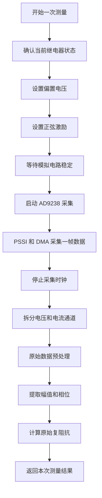
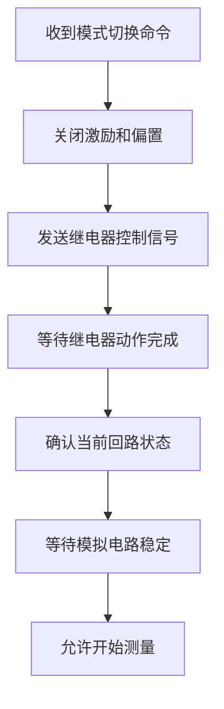
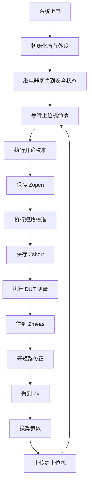
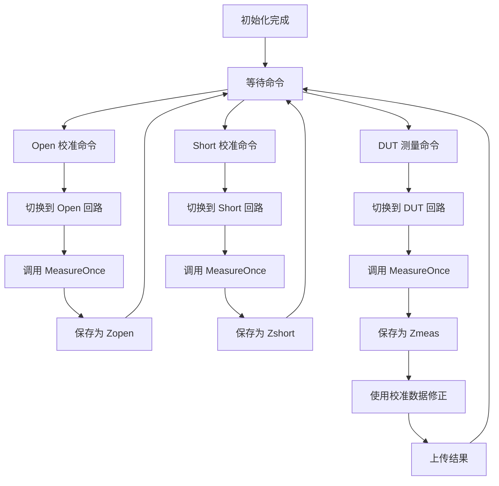
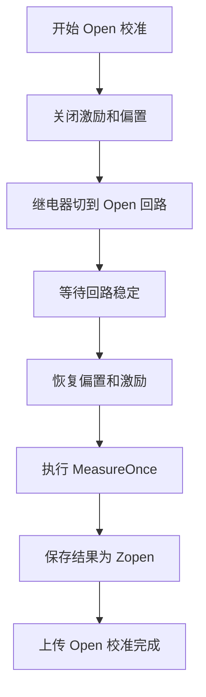
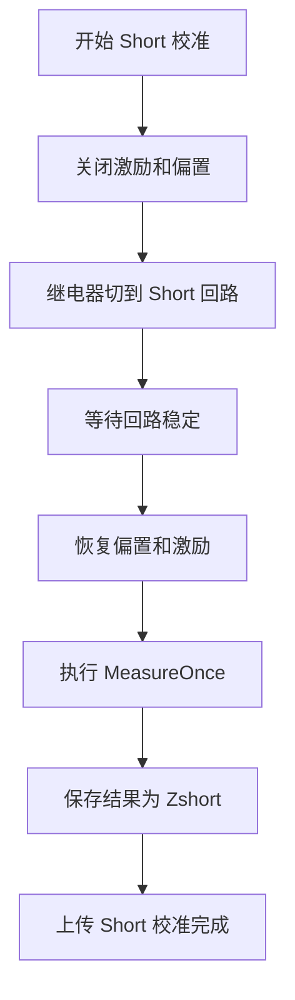
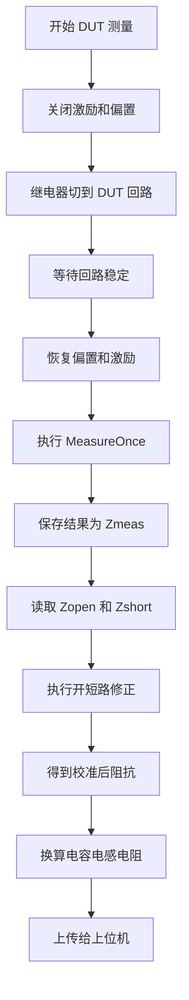
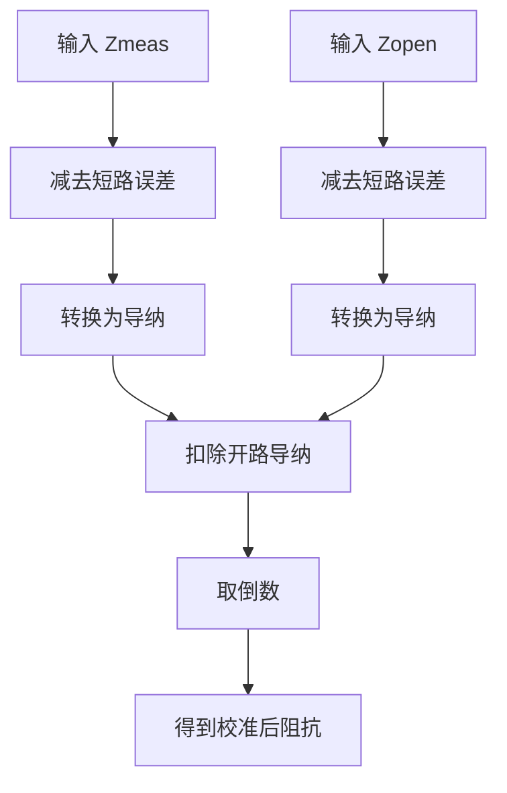
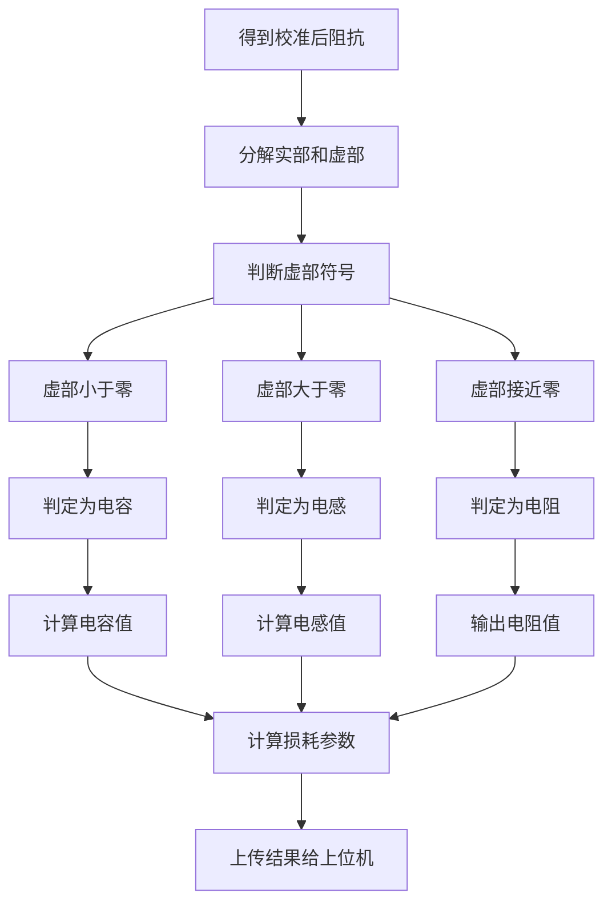
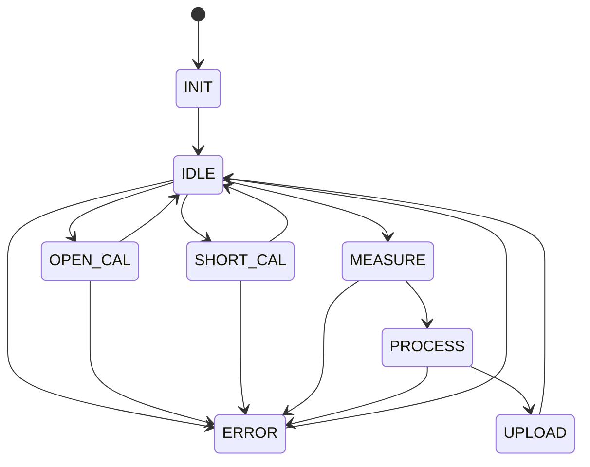

# 自制 LCR 电桥：软件架构与完整测量流程

> 整理说明：本文档整合 LCR 电桥的软件模块划分、MeasureOnce 最小测量闭环、继电器矩阵、开短路校准、DUT 测量及上位机分工。原有信息全部保留，并按总体架构到具体流程的顺序集中到一份文档中。

## 本文档包含

1. 自制 LCR 电桥软件模块整理
2. 自制 LCR 电桥：最小测量闭环与继电器矩阵流程修正版

---

## 第 1 部分：自制 LCR 电桥软件模块整理

本文档整理当前项目软件部分需要完成的代码模块。目标是先跑通最小测量闭环：

```text
STM32 完成一次测量
得到一次结果
上传给上位机显示
```

开路校准、短路校准、DUT 正常测量，本质上都共用同一个底层测量流程，只是继电器矩阵切换到不同状态。

---
![[IMG_1334(20260614-171130).png]]
![[IMG_1333(20260614-171111).png]]
### 1. STM32 底层外设驱动模块

#### 1.1 DDS 控制模块

作用：

- 控制 DDS 输出正弦激励信号。
- 当前阶段先固定输出 1 MHz。
- 后续扩展为上位机可设置频率和幅值。

需要完成：

```text
DDS_Init()
DDS_SetFrequency(freq)
DDS_Start()
DDS_Stop()
```

---

#### 1.2 DAC1220 偏置控制模块

作用：

- 控制 DAC1220 输出控制电压。
- 通过后级电路生成 DUT 偏置电压。
- 继电器切换前要把偏置降到安全值。

需要完成：

```text
DAC1220_Init()
DAC1220_SetBiasVoltage(voltage)
DAC1220_SetSafeVoltage()
```

---

#### 1.3 AD9238 采集模块

作用：

- 控制 AD9238 采集电压通道和电流通道数据。
- STM32 通过 PSSI 接收并行数据。
- DMA 将一帧采样数据写入内存。

需要完成：

```text
AD9238_Init()
AD9238_StartCapture()
AD9238_StopCapture()
AD9238_WaitFrameDone()
AD9238_GetRawBuffer()
```

---

#### 1.4 PSSI + DMA 数据接收模块

作用：

- 配置 PSSI 接收 AD9238 并行数据。
- 配置 DMA 自动搬运采样数据。
- 判断一帧数据是否采集完成。

需要完成：

```text
PSSI_DMA_Init()
PSSI_DMA_Start(buffer, length)
PSSI_DMA_Stop()
PSSI_DMA_IsDone()
```

---

#### 1.5 继电器矩阵控制模块

作用：

- 负责切换硬件测量回路。
- 不负责采样。
- 不负责计算。

建议状态：

```text
RELAY_INIT       初始化，全断开，安全状态
RELAY_OPEN       开路校准状态
RELAY_SHORT      短路校准状态
RELAY_DUT        DUT 正常测量状态
RELAY_DISCHARGE  放电状态
RELAY_RANGE_1    量程 1
RELAY_RANGE_2    量程 2
RELAY_RANGE_3    量程 3
```

需要完成：

```text
Relay_Init()
Relay_SetState(state)
Relay_GetState()
Relay_AllOff()
Relay_WaitStable()
```

切换继电器时建议流程：

```text
关闭 DDS 激励
DAC 偏置降到安全值
等待放电
切换继电器
等待继电器稳定
重新开启偏置和激励
```

---

#### 1.6 串口通信模块

作用：

- 接收上位机命令。
- 上传校准结果、测量结果和错误状态。

当前最小命令：

| 命令 | STM32 动作 |
|---|---|
| INIT | 初始化系统 |
| SET_PARAM | 设置频率、幅值、偏置、量程 |
| OPEN_CAL | 切换 Open 回路并执行一次测量 |
| SHORT_CAL | 切换 Short 回路并执行一次测量 |
| MEASURE | 切换 DUT 回路并执行一次测量 |
| RELAY_INIT | 继电器全断开 |
| STOP | 关闭激励和偏置 |

需要完成：

```text
UART_Comm_Init()
UART_ParseCommand()
UART_SendAck()
UART_SendResult()
UART_SendError()
```

---

### 2. 核心测量模块 MeasureOnce

这是整个 STM32 软件最核心的模块。

`MeasureOnce` 不关心当前是开路、短路还是 DUT 测量，它只负责在当前继电器状态下采集一次数据，并计算一个原始复阻抗。

输出：

```text
Zraw = Rraw + jXraw
```

需要完成：

```text
MeasureOnce()
```

内部流程：

```text
确认当前继电器状态
设置偏置电压
设置 DDS 正弦激励
等待模拟电路稳定
启动 AD9238 采集
PSSI + DMA 采集一帧数据
停止采集
拆分电压和电流通道
原始数据预处理
提取 V/I 幅值和相位
计算原始复阻抗 Zraw
返回本次测量结果
```

---

### 3. 数据处理模块

#### 3.1 原始数据预处理

作用：

- 从 DMA buffer 中拆分电压通道和电流通道。
- 取有效 ADC 位宽。
- 无符号数据转有符号数据。
- 去除直流分量。
- 可选：滤波、窗函数、异常点处理。

需要完成：

```text
Split_VI_Channel()
ADC_RawToSigned()
Remove_DC()
PreprocessSignal()
```

---

#### 3.2 幅值和相位提取

作用：

- 计算电压信号幅值。
- 计算电流信号幅值。
- 计算电压和电流之间的相位差。

可以先用简单算法跑通，后续再优化。

需要完成：

```text
CalcAmplitude()
CalcPhase()
ExtractVI()
```

---

#### 3.3 原始复阻抗计算

作用：

- 根据 V 和 I 的幅值、相位差，计算原始复阻抗。

需要完成：

```text
CalcRawImpedance()
```

输出：

```text
Rraw
Xraw
Zraw
```

---

### 4. 校准模块

#### 4.1 Open 开路校准

流程：

```text
关闭激励和偏置
继电器切到 RELAY_OPEN
等待稳定
恢复偏置和激励
调用 MeasureOnce
保存结果为 Zopen
上传 Open 校准完成
```

需要完成：

```text
DoOpenCalibration()
```

---

#### 4.2 Short 短路校准

流程：

```text
关闭激励和偏置
继电器切到 RELAY_SHORT
等待稳定
恢复偏置和激励
调用 MeasureOnce
保存结果为 Zshort
上传 Short 校准完成
```

需要完成：

```text
DoShortCalibration()
```

---

#### 4.3 校准数据管理

作用：

- 保存 `Zopen`。
- 保存 `Zshort`。
- 记录 Open/Short 是否已经完成。
- DUT 测量前检查校准状态。

需要完成：

```text
Calibration_SaveOpen()
Calibration_SaveShort()
Calibration_IsReady()
Calibration_Clear()
```

---

### 5. DUT 测量与修正模块

#### 5.1 DUT 原始测量

流程：

```text
关闭激励和偏置
继电器切到 RELAY_DUT
等待稳定
恢复偏置和激励
调用 MeasureOnce
保存结果为 Zmeas
```

需要完成：

```text
DoDutMeasure()
```

---

#### 5.2 开短路修正

修正公式：

```text
Zx = 1 / ( 1 / (Zmeas - Zshort) - 1 / (Zopen - Zshort) )
```

需要完成：

```text
CorrectOpenShort()
```

输入：

```text
Zmeas
Zopen
Zshort
```

输出：

```text
Zx
```

---

#### 5.3 C / L / R 参数换算

根据：

```text
Zx = R + jX
```

判断：

```text
X < 0      电容
X > 0      电感
X 接近 0   电阻
```

电容：

```text
C = 1 / (2 * pi * f * abs(X))
```

电感：

```text
L = X / (2 * pi * f)
```

电阻：

```text
R = real(Zx)
```

需要完成：

```text
CalcCLR()
```

---

### 6. STM32 状态机模块

建议最小状态机：

```text
INIT
IDLE
OPEN_CAL
SHORT_CAL
MEASURE
PROCESS
UPLOAD
ERROR
```

状态机职责：

- 上电后初始化外设。
- 等待上位机命令。
- 根据命令进入校准或测量流程。
- 出错时进入 ERROR。
- 完成后回到 IDLE。

需要完成：

```text
SystemStateMachine_Init()
SystemStateMachine_Run()
System_HandleCommand()
System_SetError()
```

---

### 7. STM32 上传结果格式

每次测量或校准完成后，STM32 上传一包结果。

最小字段：

```text
mode
freq
bias
relay_state
R
X
C
L
status
```

示例：

```text
mode = MEASURE
freq = 1000000
bias = 0
relay_state = DUT
R = 1.23
X = -159.2
C = 1.00e-9
L = 0
status = OK
```

---

### 8. 上位机软件模块

#### 8.1 串口连接模块

作用：

- 打开串口。
- 设置波特率。
- 发送命令。
- 接收 STM32 返回数据。

需要完成：

```text
Serial_Open()
Serial_Close()
Serial_SendCommand()
Serial_ReadResult()
```

---

#### 8.2 控制命令模块

界面按钮对应命令：

```text
初始化       INIT
开路校准     OPEN_CAL
短路校准     SHORT_CAL
开始测量     MEASURE
继电器全断开 RELAY_INIT
停止         STOP
```

---

#### 8.3 显示模块

当前阶段需要显示：

- 当前串口连接状态。
- 当前继电器状态。
- Open 校准是否完成。
- Short 校准是否完成。
- 测量频率。
- 偏置电压。
- R。
- X。
- C。
- L。
- 状态信息。

---

#### 8.4 数据保存模块

后续扩展：

- 保存测量历史。
- 导出 CSV。
- 多频点扫描数据保存。
- 曲线绘制。

当前阶段可以先不做复杂功能。

---

### 9. 推荐开发顺序

#### 第一步：只跑通 MeasureOnce

目标：

```text
固定继电器在 DUT 回路
接一个已知电容或电阻
STM32 能采集 V/I
能得到一个 Zraw
能通过串口上传
```

完成标志：

```text
上位机能看到 Rraw、Xraw 或 Zraw
```

---

#### 第二步：加入继电器切换

目标：

```text
上位机发送继电器状态
STM32 切换电路
返回切换成功
```

完成标志：

```text
OPEN、SHORT、DUT、INIT 都能正确切换
```

---

#### 第三步：加入 Open 校准

目标：

```text
继电器切 Open
调用 MeasureOnce
保存 Zopen
上传 Open 校准成功
```

完成标志：

```text
上位机显示 Open 校准完成
```

---

#### 第四步：加入 Short 校准

目标：

```text
继电器切 Short
调用 MeasureOnce
保存 Zshort
上传 Short 校准成功
```

完成标志：

```text
上位机显示 Short 校准完成
```

---

#### 第五步：加入 DUT 修正测量

目标：

```text
继电器切 DUT
调用 MeasureOnce
得到 Zmeas
使用 Zopen 和 Zshort 修正
上传 Zx、R、X、C 或 L
```

完成标志：

```text
上位机能显示校准后的电容、电感或电阻结果
```

---

#### 第六步：完善上位机

目标：

```text
显示校准状态
显示当前回路
显示测量结果
保存历史数据
后续扩展多频点扫描
```

---

### 10. 最小可实现代码文件划分建议

STM32 端可以这样拆：

```text
app_main.c              主流程和状态机
measure.c / measure.h   MeasureOnce 核心测量
relay.c / relay.h       继电器矩阵控制
dds.c / dds.h           DDS 控制
dac1220.c / dac1220.h   DAC 偏置控制
ad9238.c / ad9238.h     AD9238 采集
pssi_dma.c / pssi_dma.h PSSI + DMA
signal.c / signal.h     数据预处理、幅相提取
impedance.c / impedance.h 阻抗计算、校准修正、C/L/R 换算
comm.c / comm.h         串口命令和结果上传
calibration.c / calibration.h 校准数据管理
```

上位机端可以这样拆：

```text
main.py                 上位机入口
serial_comm.py          串口通信
commands.py             命令封装
parser.py               STM32 返回数据解析
ui.py                   界面显示
data_logger.py          数据保存
```

---

### 11. 当前阶段最重要的架构原则

```text
MeasureOnce 是底层核心。
Open 校准、Short 校准、DUT 测量都是 MeasureOnce 的不同应用。
继电器矩阵只负责切换电路，不负责计算。
STM32 负责一次测量和一次结果上传。
上位机负责显示、记录和后续复杂功能。
```

---

## 第 2 部分：自制 LCR 电桥：最小测量闭环与继电器矩阵流程修正版

> 本文档用于 Obsidian。  
> 重点：先跑通一个最小可行功能：**STM32 完成一次测量，得到一次结果，然后上传给上位机显示**。  
> 说明：开路校准、短路校准、正常 DUT 测量，本质上都是同一个测量流程，只是继电器矩阵切换到了不同电路状态。

---

### 1. 当前阶段目标

当前阶段不要先做完整仪器功能，而是先实现最基础的闭环：

```text
初始化系统
    ↓
切换继电器到开路状态
    ↓
执行一次测量，得到 Zopen
    ↓
切换继电器到短路状态
    ↓
执行一次测量，得到 Zshort
    ↓
切换继电器到 DUT 测量状态
    ↓
执行一次测量，得到 Zmeas
    ↓
用 Zopen 和 Zshort 修正
    ↓
得到 Zx
    ↓
换算 C、L、R
    ↓
上传给上位机显示
```

---

### 2. 核心思想

开路校准、短路校准、正常测量，不应该写成三套完全不同的软件流程。

它们应该共用同一个底层测量流程：

```text
MeasureOnce
```

区别只是：

| 模式 | 继电器矩阵状态 | MeasureOnce 结果含义 |
|---|---|---|
| Open 校准 | 被测端开路 | Zopen |
| Short 校准 | 被测端短路 | Zshort |
| DUT 测量 | 被测件接入 | Zmeas |

所以软件结构应该是：

```text
切换电路状态
    ↓
调用 MeasureOnce
    ↓
根据当前模式保存结果
```

---

### 3. 一次完整测量过程：MeasureOnce

### 3.1 MeasureOnce 的定义

一次完整测量过程指的是：

```text
在当前继电器矩阵状态下，
STM32 控制 DDS、DAC、AD9238，
采集一次 V/I 数据，
并计算出一个原始复阻抗 Zraw。
```

MeasureOnce 不关心现在是开路、短路还是正常测量。

它只负责得到：

```text
Zraw = Rraw + jXraw
```

---

### 3.2 MeasureOnce 流程图

> Mermaid 显示注意：  
> 这里节点文字尽量不用 `C = 1 / (2πf|X|)`、`V/I`、`Z = R + jX` 这类复杂公式，避免 Obsidian Mermaid 渲染异常。公式放在正文里，不放进流程图节点。



---

### 3.3 MeasureOnce 各部分作用

| 步骤 | 作用 |
|---|---|
| 确认当前继电器状态 | 确认硬件已经切换到 Open、Short 或 DUT 回路 |
| 设置偏置电压 | DAC1220 输出控制电压，后级生成偏置电压 |
| 设置正弦激励 | DDS 输出 1 MHz 正弦激励 |
| 等待模拟稳定 | 等待继电器触点、电桥、偏置电压、运放稳定 |
| 启动 AD9238 采集 | AD9238 输出电压和电流两路数据 |
| PSSI 和 DMA 采集 | STM32 通过 PSSI 接收并行数据，DMA 写入内存 |
| 停止采集时钟 | 一帧采满后停止，避免持续占用资源 |
| 拆分 V/I 通道 | 将交替采集的数据拆成电压通道和电流通道 |
| 数据预处理 | 取低 12 位、无符号转有符号、去直流 |
| 幅相提取 | 计算 V 和 I 的幅值、相位差 |
| 阻抗计算 | 得到原始复阻抗 Zraw |

---

### 4. 继电器矩阵在软件中的作用

### 4.1 继电器矩阵不是测量算法

继电器矩阵的作用是：

```text
切换硬件测量回路
```

它不负责计算，也不负责采样。

它只做一件事：

```text
把电桥切换到当前需要的电路状态
```

例如：

```text
开路校准状态
短路校准状态
DUT 测量状态
放电状态
初始化全断开状态
不同电容测量回路
不同采样电阻量程
```

---

### 4.2 参考代码中的继电器切换思想

你给的参考上位机代码里，继电器矩阵通过串口发送 ASCII 数字进行切换。  
代码里把 `1~8` 定义成不同回路，并且 `switch_to()` 发送对应数字后等待单片机回复相同数字，用来确认切换成功。

参考代码中的映射逻辑可以整理为：

| 指令 | 回路含义 |
|---|---|
| 1 | Ciss 测量回路 |
| 2 | Ciss 放电回路 |
| 3 | Coss 测量回路 |
| 4 | Coss 放电回路 |
| 5 | Crss 测量回路 |
| 6 | Crss 放电回路 |
| 7 | Rg 测量回路 |
| 8 | 初始化，全断开 |

---

### 4.3 对自制 LCR 电桥的继电器矩阵抽象

你自己的电桥不一定完全使用 Ciss、Coss、Crss 这些回路，但思想一样。

建议 STM32 内部把继电器状态抽象成下面几类：

| 继电器状态 | 作用 |
|---|---|
| RELAY_INIT | 初始化，全断开，安全状态 |
| RELAY_OPEN | 开路校准状态 |
| RELAY_SHORT | 短路校准状态 |
| RELAY_DUT | 正常 DUT 测量状态 |
| RELAY_DISCHARGE | 放电状态 |
| RELAY_RANGE_1 | 量程 1 |
| RELAY_RANGE_2 | 量程 2 |
| RELAY_RANGE_3 | 量程 3 |

---

### 4.4 继电器切换流程图



---

### 4.5 为什么切换继电器前要关闭激励和偏置

继电器切换时不建议带电切换，尤其是你后面有：

```text
0 到 100 V 偏置电压
1 MHz 交流激励
被测电容储能
```

所以切换顺序建议是：

```text
关闭 DDS 激励
    ↓
DAC 偏置降到安全值
    ↓
等待放电
    ↓
切换继电器
    ↓
等待继电器稳定
    ↓
重新开启偏置和激励
```

---

### 5. 最小完整测量闭环

### 5.1 总流程图



---

### 5.2 更符合软件结构的流程图



---

### 6. 开路校准流程

### 6.1 开路校准也是一次测量

开路校准不是特殊算法，它就是：

```text
继电器切到开路状态
    ↓
执行 MeasureOnce
    ↓
把结果保存为 Zopen
```

---

### 6.2 开路校准流程图



---

### 7. 短路校准流程

### 7.1 短路校准也是一次测量

短路校准就是：

```text
继电器切到短路状态
    ↓
执行 MeasureOnce
    ↓
把结果保存为 Zshort
```

---

### 7.2 短路校准流程图



---

### 8. DUT 正常测量流程

### 8.1 DUT 测量也是一次测量

DUT 测量就是：

```text
继电器切到 DUT 测量状态
    ↓
执行 MeasureOnce
    ↓
把结果保存为 Zmeas
    ↓
使用 Zopen 和 Zshort 修正
```

---

### 8.2 DUT 测量流程图



---

### 9. 开短路修正公式

### 9.1 复阻抗修正

```text
Zx = 1 / ( 1 / (Zmeas - Zshort) - 1 / (Zopen - Zshort) )
```

其中：

```text
Zmeas  = DUT 状态测得的原始复阻抗
Zshort = 短路状态测得的复阻抗
Zopen  = 开路状态测得的复阻抗
Zx     = 校准后的复阻抗
```

---

### 9.2 修正流程图



---

### 10. 电容测量流程图修正版

> 原先显示有问题，多半是 Mermaid 节点中包含了公式、斜杠、绝对值符号、希腊字母或复杂标点。  
> 下面这个版本把公式移到正文，流程图节点只保留普通文字，Obsidian 更容易正常显示。



---

### 10.1 电容计算公式

如果：

```text
Zx = R + jX
```

并且：

```text
X < 0
```

则表现为电容：

```text
C = 1 / (2 * pi * f * abs(X))
```

其中：

```text
f = 测量频率
X = 阻抗虚部
```

---

### 10.2 电感计算公式

如果：

```text
X > 0
```

则表现为电感：

```text
L = X / (2 * pi * f)
```

---

### 10.3 电阻判断

如果：

```text
X 接近 0
```

则近似认为是电阻：

```text
R = real(Zx)
```

---

### 11. STM32 和上位机分工

### 11.1 STM32 负责

STM32 当前阶段只负责完成测量核心：

```text
1. 接收上位机命令
2. 初始化 DDS、DAC、AD9238、继电器矩阵
3. 控制继电器切换电路
4. 控制 DDS 输出 1 MHz 正弦
5. 控制 DAC 输出偏置
6. 控制 AD9238 采集 V 和 I
7. 执行一次 MeasureOnce
8. 保存 Zopen 和 Zshort
9. 计算 Zmeas 和 Zx
10. 上传结果给上位机
```

---

### 11.2 上位机负责

上位机负责展示和管理：

```text
1. 显示测量结果
2. 显示校准状态
3. 显示当前继电器回路
4. 设置频率、偏置、量程
5. 发送 Open 校准命令
6. 发送 Short 校准命令
7. 发送 DUT 测量命令
8. 保存历史数据
9. 绘制曲线
10. 后续做多频点扫描
```

---

### 12. 上位机命令建议

当前阶段只需要几个最小命令：

| 命令 | STM32 动作 |
|---|---|
| INIT | 初始化系统 |
| SET_PARAM | 设置频率、幅值、偏置、量程 |
| OPEN_CAL | 切换 Open 回路并执行一次测量 |
| SHORT_CAL | 切换 Short 回路并执行一次测量 |
| MEASURE | 切换 DUT 回路并执行一次测量 |
| RELAY_INIT | 继电器全断开 |
| STOP | 关闭激励和偏置 |

---

### 13. STM32 上传结果建议

每次完成一次测量后，STM32 上传一包结果给上位机。

最小版本可以上传：

```text
mode
freq
bias
relay_state
R
X
C
L
status
```

例如：

```text
mode = MEASURE
freq = 1000000
bias = 0
relay_state = DUT
R = 1.23
X = -159.2
C = 1.00e-9
status = OK
```

---

### 14. 最小状态机



---

### 15. 推荐开发顺序

### 第一步：只跑通 MeasureOnce

```text
固定继电器在 DUT 回路
接一个已知电容或电阻
STM32 能采集 V/I
能得到一个 Zraw
能通过串口上传
```

---

### 第二步：加入继电器切换

```text
上位机发送继电器状态
STM32 切换电路
返回切换成功
```

---

### 第三步：加入 Open 校准

```text
继电器切 Open
调用 MeasureOnce
保存 Zopen
上传 Open 成功
```

---

### 第四步：加入 Short 校准

```text
继电器切 Short
调用 MeasureOnce
保存 Zshort
上传 Short 成功
```

---

### 第五步：加入 DUT 修正测量

```text
继电器切 DUT
调用 MeasureOnce
得到 Zmeas
用 Zopen 和 Zshort 修正
上传 Zx、R、X、C
```

---

### 16. 最终总结

当前阶段最重要的软件架构是：

```text
MeasureOnce 是底层核心。
Open 校准、Short 校准、DUT 测量都是 MeasureOnce 的不同应用。
继电器矩阵只负责切换电路，不负责计算。
STM32 只负责完成一次测量和一次结果上传。
上位机负责显示、记录和后续复杂功能。
```

---

